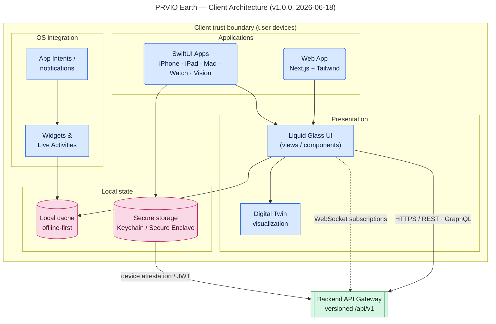
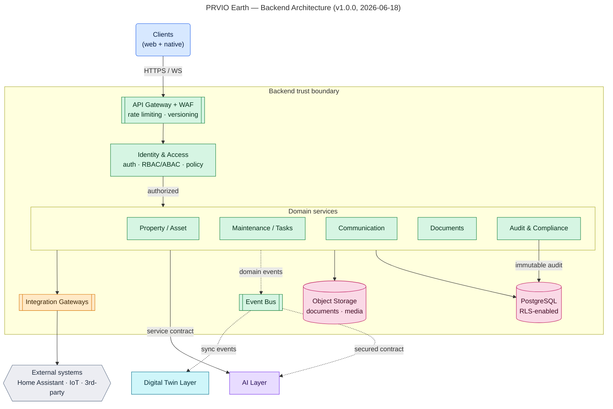
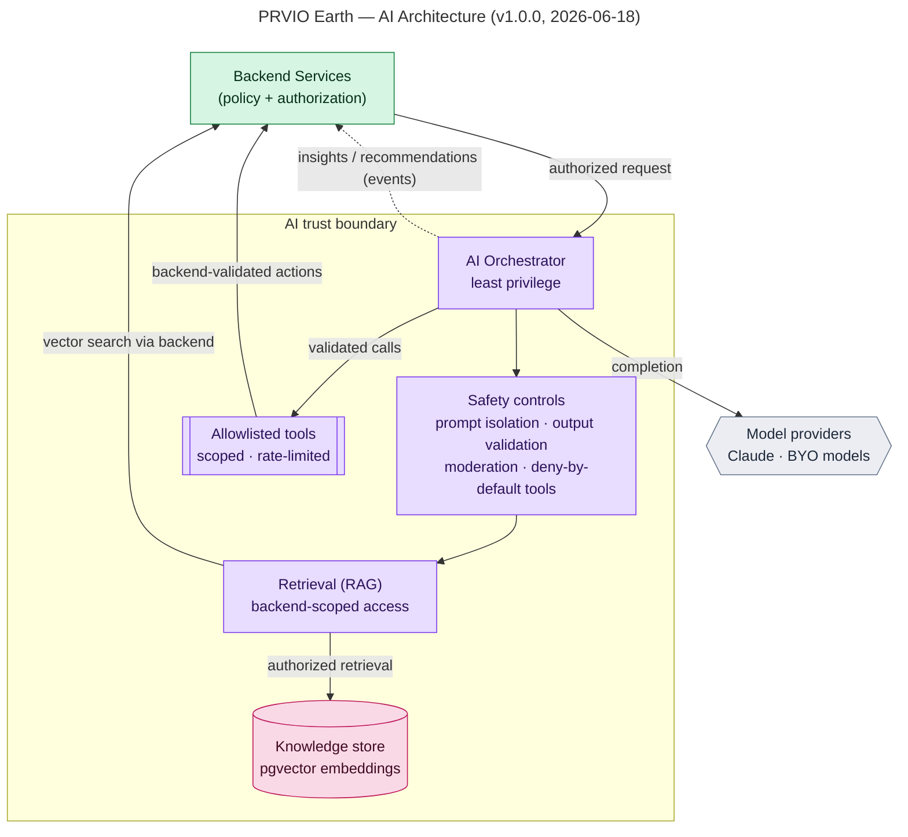
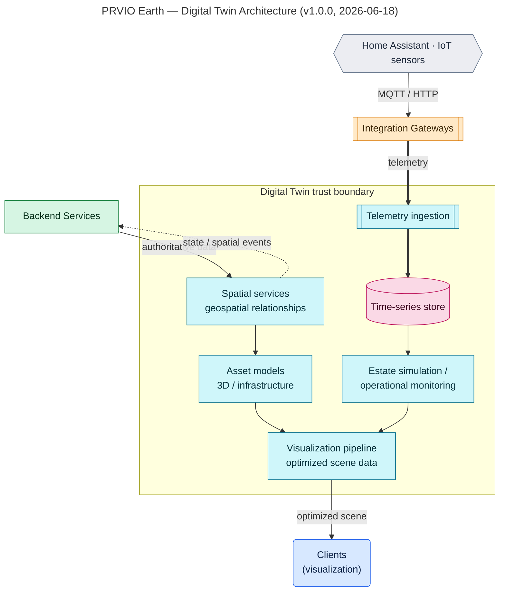
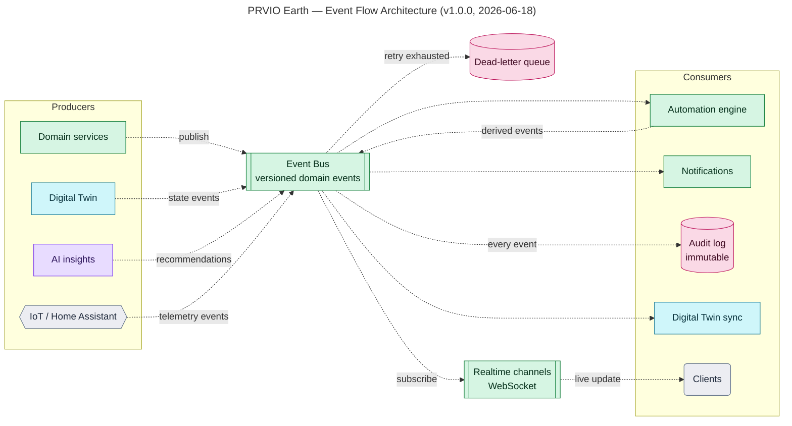
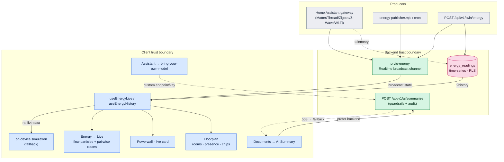

# PRVIO Earth — Architecture Diagram Set

**Version:** v1.0.0
**Last updated:** 2026-06-19
**Author:** PRVIO Earth Architecture

The mandated diagram set covering each platform layer plus cross-layer event flow.
Notation, colours and shapes follow the [diagram legend](./diagram-legend.md). For the
high-level system overview, ERD and auth/real-time sequences, see
[system-overview.md](./system-overview.md).

---

## 1. Client Architecture

Apple/web client surfaces, local storage, widgets and the API boundary. Clients talk
to the backend **only** — never to databases, AI infrastructure or IoT directly.

## 2. Backend Architecture

System of record: API gateway, identity, core domain services, data + event
infrastructure, and integration gateways behind a trust boundary.

## 3. AI Architecture

Assistant orchestration with retrieval, knowledge stores, allowlisted tools and safety
controls. All access is brokered by backend authorization; BYO models are supported.

## 4. Digital Twin Architecture

Spatial services, asset models, telemetry ingestion and visualization pipelines that
synchronize with Home Assistant / IoT through backend-managed contracts.

## 5. Event Flow Architecture

Domain events, producers/consumers, the bus, real-time subscriptions and retry paths
across layers. Events are versioned; failures route to a dead-letter queue.

---

## 6. Energy & Smart-Home Architecture

The Energy module and the Home-Assistant-fed smart-home surfaces. Readings flow
over a real event bus (`prvio-energy` Supabase Realtime broadcast) and persist to
the `energy_readings` time-series; clients subscribe via `useEnergyLive` and
degrade to an on-device simulation. The HA gateway brokers all IoT — clients
never talk to devices directly.

**Notes**
- **Source badges** — every surface shows Live/Simulat (energy), Synced/Demo
  (history) or Backend AI / On-device (summaries) so the active feed is explicit.
- **Dynamic tariff** — `chargeWhenCheap` schedules EV/Powerwall charging into the
  cheapest tariff window; OCPP-style sessions track delivered energy on the EV.
- **Powercalc** — per-device wattage in the House breakdown is virtual (no meters).
