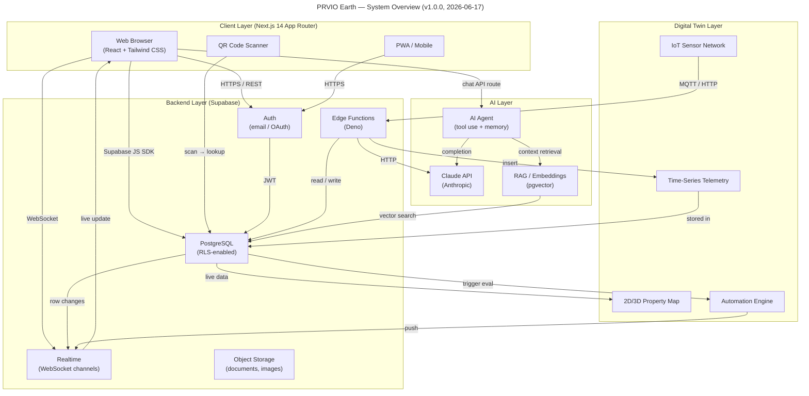
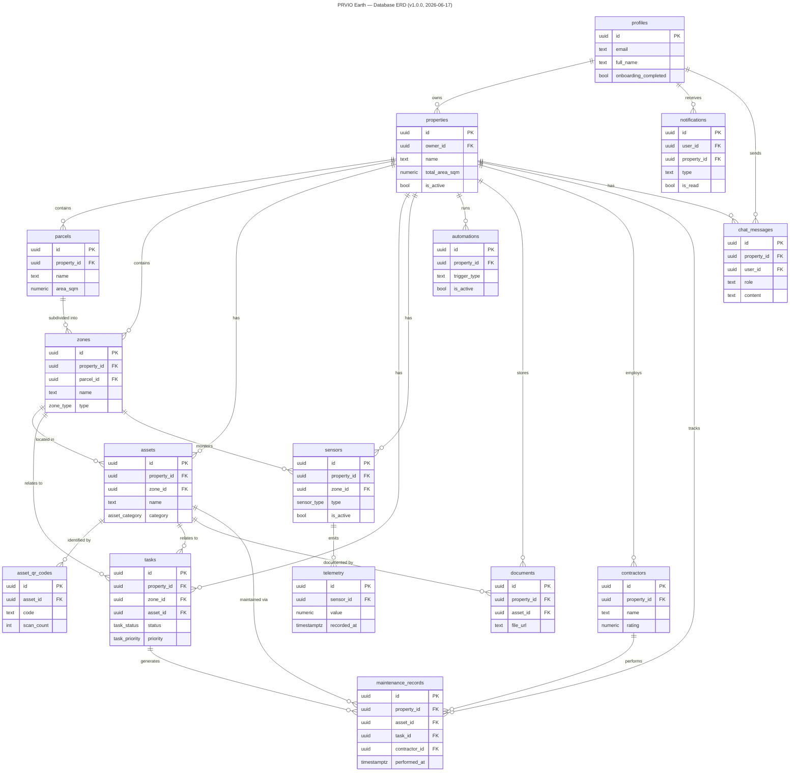
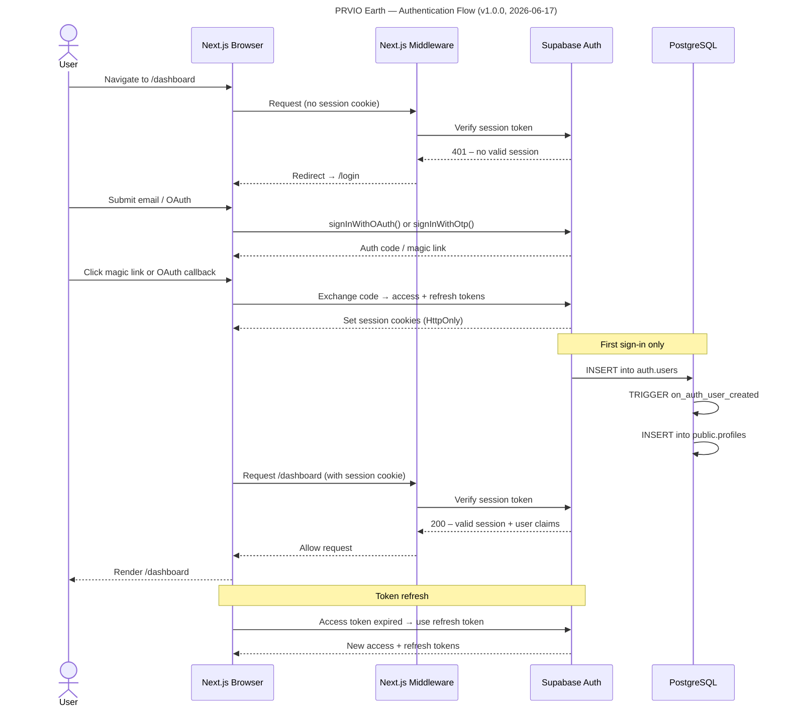
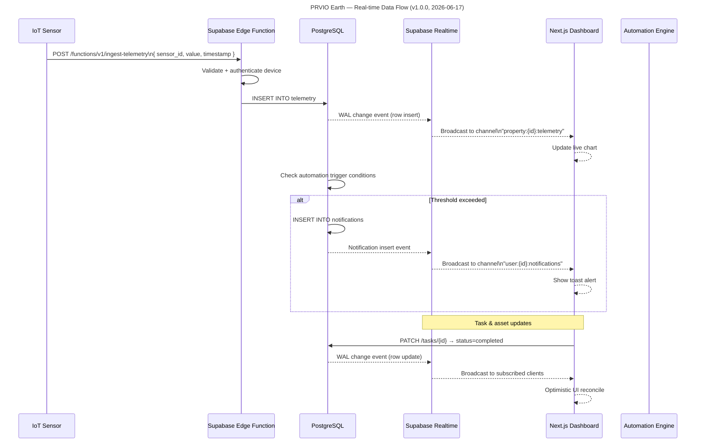

# PRVIO Earth — System Architecture

**Version:** v1.0.0  
**Date:** 2026-06-17

---

## 1. System Overview

Four-layer architecture: Client → Backend/Supabase → AI → Digital Twin.

---

## 2. Database Entity Relationship Diagram

Simplified ERD showing primary table relationships.

---

## 3. Authentication Flow

OAuth and magic-link flows via Supabase Auth with Next.js middleware session handling.

---

## 4. Real-time Data Flow

Sensor telemetry ingestion and live dashboard updates via Supabase Realtime.

